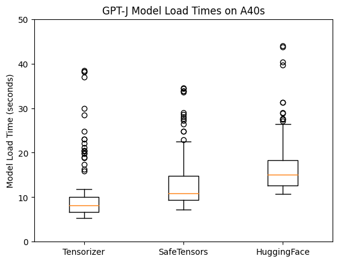
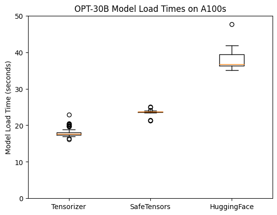

# Tensorizer Benchmarking

The files in this folder container everything needed to benchmark both the
serialization and deserialization process.

The benchmarks will be run using tensorizer,
[Safetensors](https://huggingface.co/docs/safetensors/index),
and [HuggingFace Transformers](https://huggingface.co/docs/transformers/index).

As configured, the benchmark job will deserialize
[OPT-30B](https://huggingface.co/facebook/opt-30b) 100 times using each library.
This can be reconfigured by changing the the `MODEL_ID` and `MODEL_PATH`
environment variables described under [Serialization](#serialization)
and [Deserialization](#deserialization) below.




## Running the Benchmarks

### Setup

#### Docker Image

Both benchmarks use the same docker image defined by the `Dockerfile`.

There is a publicly available version of this docker image already in the
benchmark job manifests, but if you make any changes you will need to rebuild
and push the container version containing your changes.

#### PVC

To keep variables as consistent as possible between the different packages,
the models will be saved and loaded to a single NVMe-backed PVC
(as opposed to tensorizer using CoreWeave's accelerated Object Storage).

The PVC used in the benchmark jobs is defined in `benchmark-pvc.yaml`.
To create it, run the following:

```bash
kubectl apply -f benchmark-pvc.yaml
```

### Serialization

The serialization benchmark saves the model in all three frameworks in a
single run. The script used is `save_models.py`, and the job is defined in 
`save-models-job.yaml`.

The serialization benchmark job has a number of parameters that can be edited
in the job manifest via environment variables.
 - `MODEL_ID`: HuggingFace model ID that will be saved and serialized
 - `NUM_TRIALS`: How many trials to run for each library in a single pod
 - `MODEL_PATH`: Where the model files will be saved

### Deserialization

The deserialization benchmark initializes the model into the GPU from the
serialized checkpoint files previously saved. The script used is
`deserialize_benchmark.py`, and the job is defined in `benchmark-job.yaml`.

The deserialization benchmark job has a number of parameters that can be
edited in the job manifest via environment variables.
 - `MODEL_PATH`: Path to the serialized model files
 - `MODEL_ID`: HuggingFace model ID, used to load the tokenizer for inference
 - `NUM_TRIALS`: How many trials to run for each library in a single pod
 - `RES_PATH`: Where to save the result file
 - `SKIP_INFERENCE`: Set to skip the inference test after loading the model
 - `SKIP_HF`: Skip loading the model using HuggingFace Transformers
 - `SKIP_ST`: Skip loading the model using Safetensors
 - `SKIP_TZR`: Skip loading the model using tensorizer

The benchmark job is broken up into 3 separate jobs, one for each library.
Each job has a target of `100` completions and a parallelism of `1`. This
means that 100 pods will be spawned for each library, each loading the model
once.
